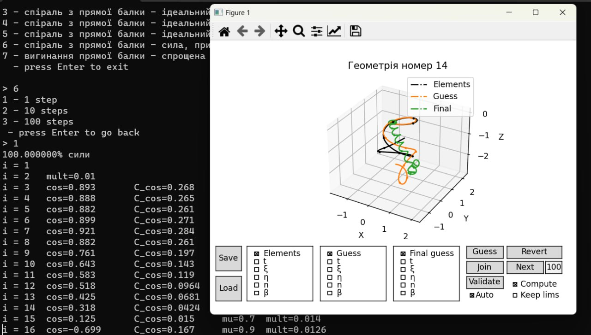

# Helix-Implementation
This is a software for studying and solving 
**3d beam deformation problems**,
written in `Python` & `Matplotlib`.

It uses an innovative approach that is called a **(Serial) Basic Helical Solutions Method**.



### How to use?
```shell
pip install -r requirements.txt
python main.py
```

### How does it work?
Is uses `Matplotlib` as a cross-platform windowing & plotting & gui backend.

### Dependencies
The following libraries are used:
* `numpy`
* `matplotlib`
* `tqdm`
